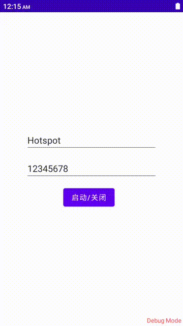

# Hotspot

Android 9 以下适配开启与关闭热点的实现。  
不过坦率的讲Android 8以后对热点的开启已经属于系统的权限范围，想绕开系统监察也已经基本不可能，所以该demo在手机上运行仍然会报App not allowed to read or update stored WiFi AP config 的错误也属于正常现象。  
除非你的系统是经过处理的，并将此权限开发出来的，又或者该应用经过系统的签名，被识别为系统应用，被授予此权限。  

---

